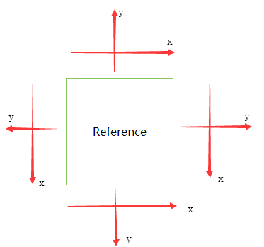
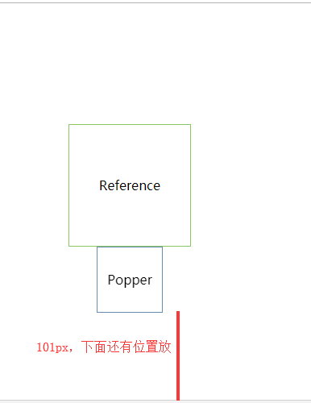
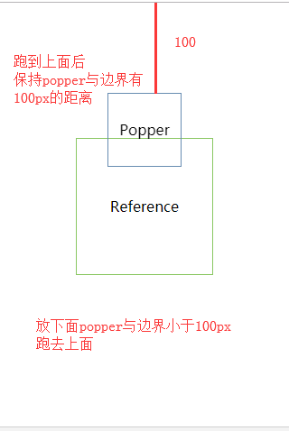
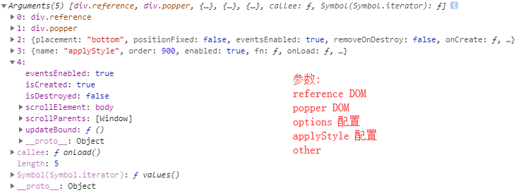

# Popper.js

## Default.Options

> 默认配置

### placement

默认位于 bottom

### positionFixed

默认false，absolute定位

### eventsEnabled

默认true，给window绑resize、scroll事件，触发时调位置

### removeOnDestroy

默认false，destroy时不删除popper

## Options

### placement ※ 

位置，可以是left、top、right、bottom，还可以更细粒，如: bottom-start、bottom、bottom-end

[placement 示例](demo-placement.html)

### eventsEnabled
 
是否为window绑resize、scroll事件，触发时调位置
 
设为false则会始终定位在那不动，不因为碰到边缘自动调整

### removeOnDestroy ※ 

destroy时是否删除 popper dom 节点

### order

大的执行顺序在前

### positionFixed ※ 

是否fixed定位

[positionFixed 示例](demo-positionFixed.html)

## modifiers

options的一个属性，用来修饰弹出行为

配置popper定位的相关修饰参数

### common

shift、offset、preventOverflow、keepTogether、arrow、flip、inner、hide、applyStyle
都有的属性

- order

执行顺序的索引

flip、offset 默认 100

preventOverflow 默认 300

keepTogether 默认 400

arrow 默认 500

flip 默认 600

inner 默认 700

hide 默认 800

computeStyle 默认 850

applyStyle 默认 900

- enabled

是否开启修饰符，默认true

inner 默认 false

例如: 

shift.enabled: false，则形如 placement: 'top-start' 的 -start 无效

offset.enabled: false，则设置的 offset: 10, 10 无效

- fn

每次更新(reize、scroll)都会一直触发，要确保里面的性能

是个 ModifierFn 函数，(data, options) => dataObject

接收参数 (data, options)

data 是 DataObject 对象

options 是当前此 modifiers 属性的信息（如 shift 对象）

函数需要 return data;

### shift

管理修饰符，如果是否 placement 的 -start 是否有效

### offset ※ 

用于调整偏移 popper

[offset 示例](demo-offset.html)
    
    // 可取类型 
    10 无单位，相当于px，只有一个数表示水平方向 10，垂直 0
    '10%' 百分比，相对于 reference 长度的百分比
    '10%r' 百分比，相对于 reference 长度的百分比
    '10%p' 百分比，相对于 popper 长度的百分比
    '10, 10' 坐标轴方向水平、垂直偏移
    '10%, 10' 
    '10 + 10%' 可以做 calc 计算，但不支持乘除
    '10 - 5vh + 3%'
    '-10px + 5vh, 5px - 6%'   

- offset

即上述可取偏移值

### preventOverflow

防止 popper 在边界之外，配置超出边界要怎么做

- priority

阻止溢出的优先级，默认 \['left','right','top','bottom']

一般不需要改

- padding ※ 

边界和 popper 间的最小距离，默认5

    new Popper(reference, popper, {
        modifiers: {
            preventOverflow: {
                padding: 100,
            },
        }
    });

注：

默认 placement 是 bottom，会主要考虑下面能放下，才会最后都放不下时，留在上面，距离上边界100px

如果设置为 placement 为 top，会定位在下方与边界距离100px

一般不需要改

- boundariesElement ※

边界元素，默认是 'scrollParent'，可以是 'scrollParent', window, 'viewport'，任何 DOM 节点

### keepTogether

确保 popper 和 reference 彼此接近

略

### arrow ※

popper 和 reference 之间的箭头

- element

箭头元素，需要放在 popper 里

默认是有 x-arrow 的元素，如 \<i x-arrow>\</i>

可以是 string(css selector)、HTMLElement

arrow 箭头的方向可以使用 popper DOM 的 x-placement属性，用CSS选择器控制

### flip

当开始覆盖 reference 时，翻转位置

要求开启 preventOverflow 

- behavior

如何去改变 popper 位置的行为

默认 'flip'

可以是 'flip'(对称定位，比如说右侧被遮挡，则定位到左侧)、'clockwise'(顺时针)、'counterclockwise'(逆时针)

还可以是个 placement 的数组\['top', 'left']

- padding ※

popper 碰到边界多少距离会翻转

默认5

- boundariesElement ※

用于定位 popper 位置的边界元素

popper 永远不会在这个边界元素之外

要求开启 keepTogether

默认 'viewport'

还可以是 DOM 节点

### inner

是否让 popper 在 reference 内部，默认 enabled 为 false

### hide ※ 

当 reference 离开 popper 的边界时，会在 popper DOM 上加 x-out-of-boundaries 的属性

可以用 CSS 根据是否有这个属性做显示隐藏操作

要求开启 preventOverflow 

### computeStyle

配置计算样式属性，告诉 PopperJS 如何去定位 popper

- gpuAcceleration ※ 

是否使用 CSS3 的 transform 去配置 popper 的位置

默认 true， 设为 false 则使用 left、top 去配置位置

- x

怎么定义 x 轴

默认 'bottom'，可选 'bottom'、'top'

如果配置为 bottom， 则用 top 来定位，反之用 bottom

- y

怎么定义 y 轴

默认 'left'，可选 'left'、'right'

如果配置为 left， 则用 right 来定位，反之用 left

### applyStyle ※ 

所有的 DOM 操作都在这个属性里做

配合框架如 react、vue 做 DOM 操作

- onLoad

在 onCreate 钩子之前触发，执行一次

- gpuAcceleration

已被移除，迁移到了 computeStyle 上

## Methods

### update

更新位置，一般用 scheduleUpdate 替代

### destroy ※ 

销毁popper

### enableEventListeners ※ 

添加上 resize、scroll 监听，让它在触发是可以重新计算位置

### disableEventListeners ※ 

移除 resize、scroll 监听，在事件触发时不再重新计算调整位置，且不再触发 onUpdate，除非手动调用 update

### scheduleUpdate ※ 

安排一次更新，会在下一次可用的UI更新时调用

## Hooks

- onCreate ※ 

初始化完成调用，接收1个参数，为具体信息

- onUpdate ※ 

调用 instance.update()、页面 resize、scroll 时触发，参数和onCreate接收的一样

**注：触发频率高**

## DataObject

onCreate、onUpdate 的回调参数和 modifiers 的配置接收，记录着各种信息

### instance

popper实例对象本身

### placement ※

当前位置，如 bottom

### originalPlacement

原始位置，即最开始配置的 placement 的值，默认 bottom

### flipped

是否翻转过，如果已经翻转过为 true

### hide ※

元素超出边界，则为 true

可用于知道何时隐藏弹出框

### arrowElement

为 modifiers 配置的 arrow 箭头 DOM 元素

### styles

popper 元素的 style 样式与定位信息

### arrowStyles

arrow 箭头的 style 样式

### boundaries?

popper 边界的偏移

### offsets

是个对象，popper 的测量值

- offsets.popper

top, left, width, height values

- offsets.reference	

top, left, width, height values

- offsets.arrow

top and left offsets

## DataObject 配合框架

配合框架如 React、Vue 时，
可以禁用 applyStyle:

    modifiers: {
        applyStyle: {
            enabled: false,
        },
        ...
    }
    
然后自定义修饰符利用 fn 操作

    modifiers: {
        applyStyle: {
            enabled: false,
        },
        applyStyleReact: {
            enabled: true,
            order: 900,
            fn(data) {
                ...
            }
        }
    }
    
     1、popper 样式:
     data.offsets.popper.position
     data.styles
     
     2、placement 位置
     data.placement
     
     3、outOfBoundariesState 是否超出边界
     data.hide
     
     4、popperInstance 实例对象
     data.instance
     
     5、arrowProps 箭头相关
     data.arrowStyles 箭头样式
     
 参考 react-popper 源码

