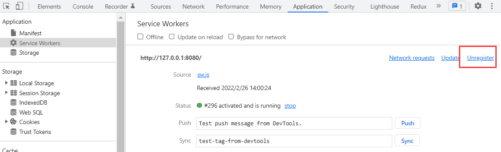
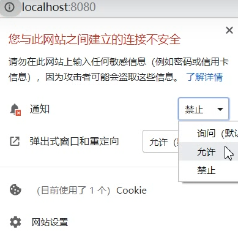

# PWA

## What's PWA

Progressive Web App，渐进式 Web 应用

PWA 不是特指某一个技术，而是经过 Web App 一系列新技术对现有的网站进行改进，所以成为渐进式（即浏览器不支持 PWA，那你这个网站就是传统的 Web 网页，支持 PWA，就能赋予相应体验）

PWA 是提升 Web 应用体验的一种方式，能给用户原生应用的体验（如离线访问等功能）

## PWA 优势

传统 Web 应用的问题：

- 强依赖网络，没有网络显示不出
- 体验相对原生应用较差，打开应用（手机上如安卓可以把页面发送成一个桌面应用快捷方式）无首屏加载动画，页面上会有地址栏等

PWA 应用：

- 适用于所有浏览器，因为它是以渐进式增强的宗旨开发的，不支持它的浏览器打开就相当于纯粹的 Web 应用，并不会导致无法访问

- 不依赖网络，能借助 Service Worker 在离线或网络较差时正常访问，展示缓存数据
- 可安装，PC 端 PWA 的应用在 Chrome 打开后，右上方更多里会出现 “安装 XXX PWA” 的选型（试了下不一定支持。。），安装后可以生成独立应用，并在 Chrome 应用（chrome://apps）可以看到它；Mobile 端 PWA 应用可以添加到桌面类似一个独立的原生应用，免去应用在商店下载的麻烦
- 原生体验，PWA 添加到手机桌面的应用，会有原生 APP 一样拥有首屏加载动画，隐藏 url 地址栏等沉浸式体验（貌似是手机上面状态栏透明化？）
- 会推送离线通知（可以让用户看到，点一下打开应用展示缓存数据，达到用户回流，减少用户丢失的效果）

## Web App Manifest

web app manifest 是应用程序清单，可以让网站安装到设备主屏幕（相当于我们的项目引入一个 manifest 文件，就可以达到这个效果），而不需要通过应用商场进行下载

manifest 是个 JSON 文件，提供了有关应用程序的信息（名称、作者、图标等）

传统的 web app 入口一般都是：

- 用户记住一个网址，后面都通过网址访问
- 把网址放到收藏夹，后面从收藏夹打开

但是这种方式导致了**用户粘性差**，用户通常在关注之前不会记住一个网站的地址，即使放入了收藏夹也可能只是吃灰操作

而 web app manifest：

- 可以添加到桌面，有唯一的图标和名称，就像一个真的 App 应用
- 有启动时界面，避免生硬
- 隐藏浏览器相关 UI 部分，如地址栏

### 常见配置

[manifest.json 配置](https://developer.mozilla.org/zh-CN/docs/Web/Manifest)

- name：指定应用名称、用户安装横幅提示的名称（即手机浏览器打开 PWA 应用时下面会有横幅提示，是否添加 [name] 到桌面的）、启动画面问的文字

- short_name：应用短名称，用户主屏幕显示（即添加到手机桌面后变成一个独立 App 应用，这个应用显示的名称，如我们手机上的的微信、微博等）

- start_url：指定启动应用程序时加载的 URL，通常就是 index.html，可以是绝对/相对路径

- icons：指定添加到桌面后应用的图标，如 QQ 的小企鹅，是个对象数组，144 x 144，配多个会自动去找比较适合的（不过现在貌似一般小的都不配了，差不多配 144 的）

  ```json
  {
      "icons": [
          {
              "src": "images/homescreen48.png",
              "sizes": "48x48",
              "type": "image/png"
          },
          {
              "src": "images/homescreen72.png",
              "sizes": "72x72",
              "type": "image/png"
          },
          {
              "src": "images/homescreen96.png",
              "sizes": "96x96",
              "type": "image/png"
          },
          {
              "src": "images/homescreen144.png",
              "sizes": "144x144",
              "type": "image/png"
          },
          {
              "src": "images/homescreen168.png",
              "sizes": "168x168",
              "type": "image/png"
          
      ]
  }
  ```

- background_color：启动动画的背景色

- theme_color：应用程序的主题色（通常影响顶部那块的颜色）

- display：指定 App 显示模式

  - fullsreen：全屏显示，即应用全屏展示，所有可用显示区域都占用，连上面时间状态栏都没了
  - standalone：让这个应用程序看起来像一个独立的应用程序，包括句有不同的窗口，在应用程序启动器中拥有自己的图标等（即下面是网页内容，上面还是暴露原有的基本信息状态栏等，也是推荐配置）
  - minimal-ui：会把地址栏出来，就变成网页那样了

### 项目启动

对应 `03-pwa-manifest`

```sh
npm run dev

# 通过 Android Studio 开模拟器 chorme 访问本地 ip
http://192.xxx.xxx.xxx:8080/

# 更多 => Add to Home screen 将应用添加到桌面
# 打开桌面应用，即可看到 manifest 配置的效果
```

## Web Worker

一个标准 PWA，包含 3 个部分：

- https 服务器或 http:localhost
- manifest.json
- service worker

service worker 基于 web worker

web worker 是：

- HTML5 API，解决 JS 主线程在同一时间只能做一件事，耗时的复杂运算会产生性能问题
- web worker 脱离主线程之外，是独立的 worker 线程，将耗时的任务在 worker 线程上计算处理后在通过 postMessage 告诉主线程
- 独立运行环境，不能操作 DOM、BOM

## Service Worker

web worker 通常用于利用独立 worker 线程做复杂运算，但处理的结果并不能被持久存下，下次有同样操作还是需要费时重新计算一遍

service worker ：

- HTML5 API
- 一旦 install 就永远存在，除非手动 unregister
- 用到的时候自动唤醒，不用的时候自动睡眠
- 可编程拦截代理请求和返回
- 可缓存文件，缓存的文件可被网页的进程取到（包括网络离线状态）
- 离线内容开发者可控
- 必须在 https 环境
- 异步实现，大都通过 Promise

### 生命周期

- install：注册成功后触发，主要用于缓存（sw.js 发生变化刷新页面会再触发）
- activate：激活时触发，主要用于删除旧缓存（再 install 后触发，如果当前已经存在 service worker，即使 sw.js 变化且刷新页面也不会触发，它会一直处在等待当前 service worker 停止）
- fetch：在发送请求时触发，主要用于操作缓存或读取网络资源

> 有时修改 sw.js 代码刷新页面不更新，可以试着卸掉 servicer worker 再刷新页面



### skipWaiting

当前已经存在 service worker 时，sw.js 变化且刷新页面也无法触发 activate

通常在 install 中利用 skipWaiting 让 service worker 跳过等待，直接进入 activate 状态

```js
self.addEventListener('install', e => {
    console.log('install', e);

    // 让 service worker 跳过等待，直接进入 activate 状态
    // self.skipWaiting();

    // 但因为 skipWaiting 返回 Promise，会导致在 install 结束前 activate 就触发了
    // 可以利用 waitUntil 解决
    // e.waitUntil 接收 promise，会在 promise 结束后才会完成当前生命周期函数
    // 如下就等 skipWaiting 结束，才进入 activate
    e.waitUntil(self.skipWaiting());
});

self.addEventListener('activate', e => {
    console.log('activate', e);
});
```

> 手动操作，可在 chrome 开发者工具 => Application => Service Workers => skipWaiting

这时修改 sw.js 刷新页面，会发现 install 触发后也同步触发了 activate

### claim

service worker 注册后，页面在下次加载前（刷新）不会使用它，即这次注册成功后，不会立即管理我们页面，需要下次刷新才生效

通常利用 claim 方法表示 service worker 激活后立即获取控制权

```js
self.addEventListener('activate', e => {
    console.log('activate', e);

    // service worker 注册后，页面在下次加载前（刷新）不会使用它，即这次注册成功后，不会立即管理我们页面，需要下次刷新才生效
    // claim 表示 service worker 激活后立即获取控制权
    e.waitUntil(self.clients.claim());
});
```

### 项目启动

对应 `04-pwa-service-worker`

```sh
npm run dev

# 访问
http://127.0.0.1:8080/

# 修改 sw.js 的内容，刷新页面可以看到 install activate 都会执行
```

## Cache Storage

cacheStorage 表示 Cache 对象的存储，配合 service worker实现资源缓存

> 可以在 chrome 开发者工具 => Cache Storage 查看

caches api 类似数据库操作：

- caches.open(key)：打开缓存，类似连接数据库，返回 promise
- caches.key()：返回所有缓存 key，返回 promise
- caches.delete(key)：删除对应 key的缓存

cache api 类型单条数据操作：

- cache.put(req, res)：把请求作为 key，并把响应结果存储
- cache.add(url)：根据 url 发起请求，并把响应结果存储
- cache.addAll(urls)：抓取一个 url 数组，并把响应结果存储
- cache.match(req)：获取 req 对应的 Response

### 常规缓存策略

常规策略并不会都走网络优先，通常来说，对于不同数据，需要不同缓存策略：

- 本地静态资源（如常规项目里 public 下）缓存优先
- 动态更新的数据（如请求接口）网络优先

缓存的资源一般需要满足条件：

- 响应状态码 200，避免缓存 304、404、50X 等
- 只缓存同源、或正确跨域的请求结果

### 项目启动

对应 `05-pwa-caches`

```sh
npm run dev

# 访问，可在开发者工具 Cache Storage 查看缓存
http://127.0.0.1:8080/ 

# 离线，开发者工具 Network 关闭网络 offline，刷新页面，依然可以拿到数据
# 走的是网络优先，无网取缓存
```

## Notification

Notification api 通知接口用于向用户配置和显示桌面通知

- Notification.permission 可获取当前用户授权情况

  - default：默认，未授权

  - denied：拒绝，如果拒绝无法再次请求授权，也无法弹框提醒

  - granted：授权，可弹框提醒

- Notification.requestPermission：申请权限

> 如果用户拒绝了，可以手动在此处调整



### 项目启动

对应 `06-pwa-notification`

```sh
npm run dev

# 访问
http://127.0.0.1:8080/ 

# 离线，开发者工具 Network 关闭网络 offline
# 刷新页面，观察下能不能看到系统弹出的无网通知提示（不行的话可能的启动别的项目影响了，清下 chrome 缓存）

# 再切回有网，观察下能不能看到系统弹出的有网通知提示
```

## 常见问题

### 怎么添加到桌面

Android 手机在 chrome 浏览器里可通过 **Add to Home screen** 添加

iOS 在 safari 浏览器可通过：点击添加图标 => 添加到主屏幕

> 不知为何都不能自动弹框提示添加？

### iOS 添加到桌面的 PWA 应用，manifest 中配置无效

[iOS（safari）中的处理方式](https://pwa.alienzhou.com/manifest#5.-iossafari-zhong-de-chu-li-fang-shi)
